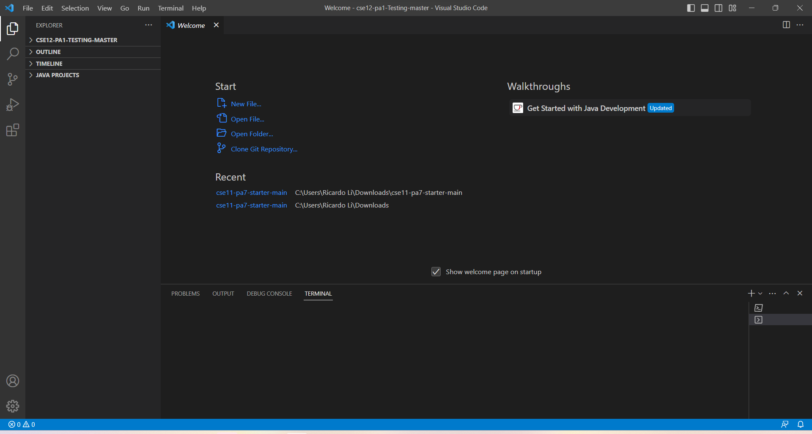
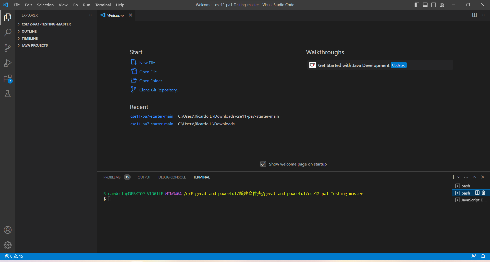
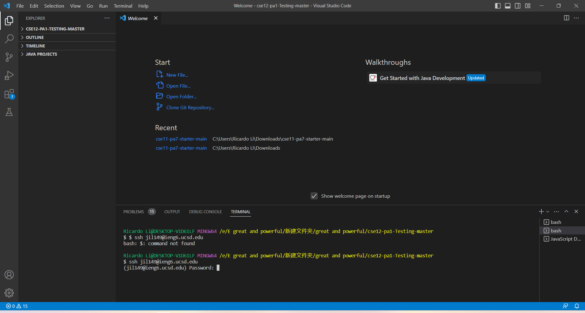
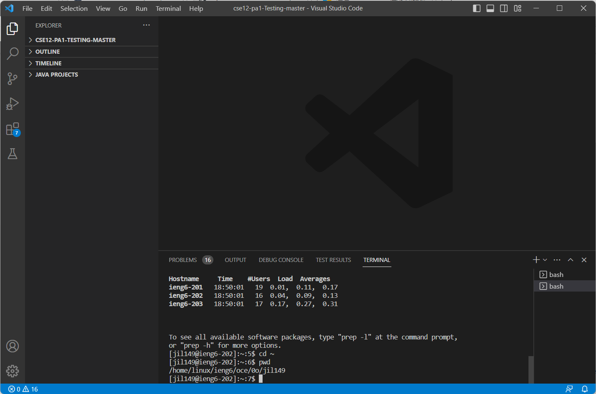

Go to the Visual Studio Code website https://code.visualstudio.com/, and follow the instructions to download and install it on your computer. 
 

Once oppened
There is a first step you need if you’re on Windows: install git for Windows, which comes with some useful tools we need:

Git for Windows

Once installed, use the steps in this post to set your default terminal to use the newly-installed git bash in Visual Studio Code:

Using Bash on Windows in Vscode
Then going back to the vs code window.
press and hold Ctrl + ` to open the terminal.
Open the command palette using Ctrl + Shift + P.
Type - Select Default Profile
Select Git Bash from the options
Click on the + icon in the terminal window
The new terminal now will be a Git Bash terminal. Give it a few seconds to load Git Bash
 
Now you can see different terminals on the right just like this, which you can navigate inbetween.
 
 
Then just put in this command $ssh+ your class account to loging in, type in the password that pumps up in below. Then you will be logged into the application.

Here are some command code:
cd ~

cd

ls -lat

ls -a

ls <directory> where <directory> is /home/linux/ieng6/cs15lsp23/cs15lsp23abc, where the abc is one of the other group members’ username

cp /home/linux/ieng6/cs15lsp23/public/hello.txt ~/

cat /home/linux/ieng6/cs15lsp23/public/hello.txt

UCSDChange2023

 
